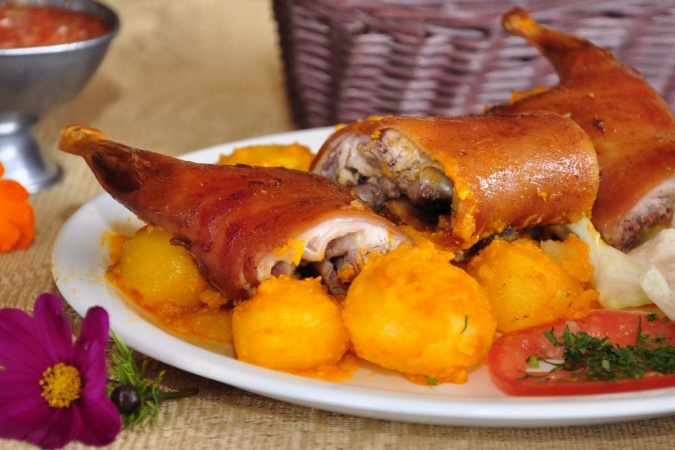
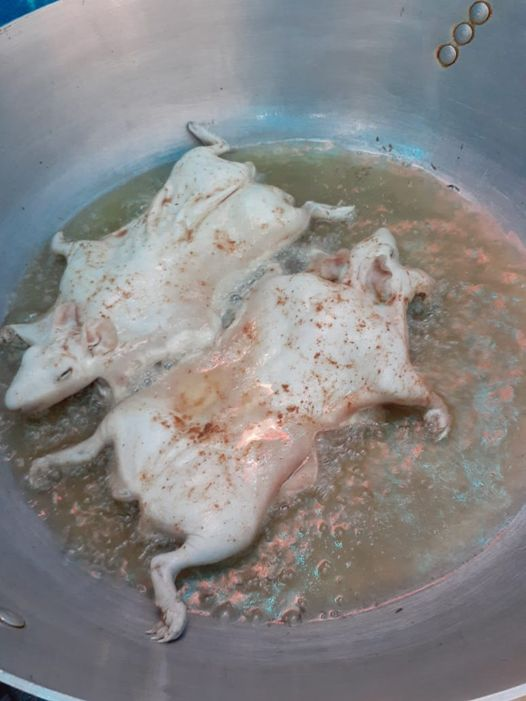
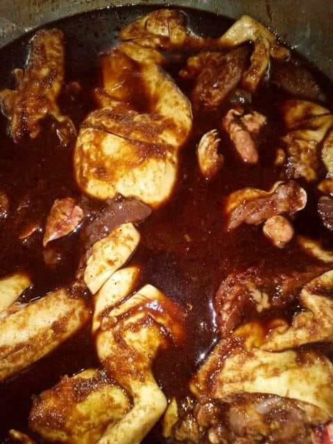
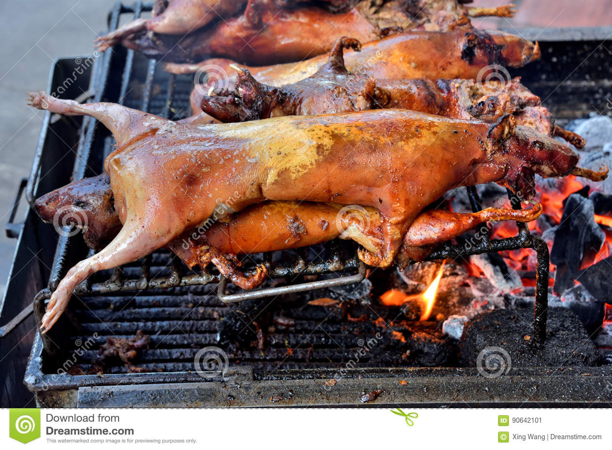
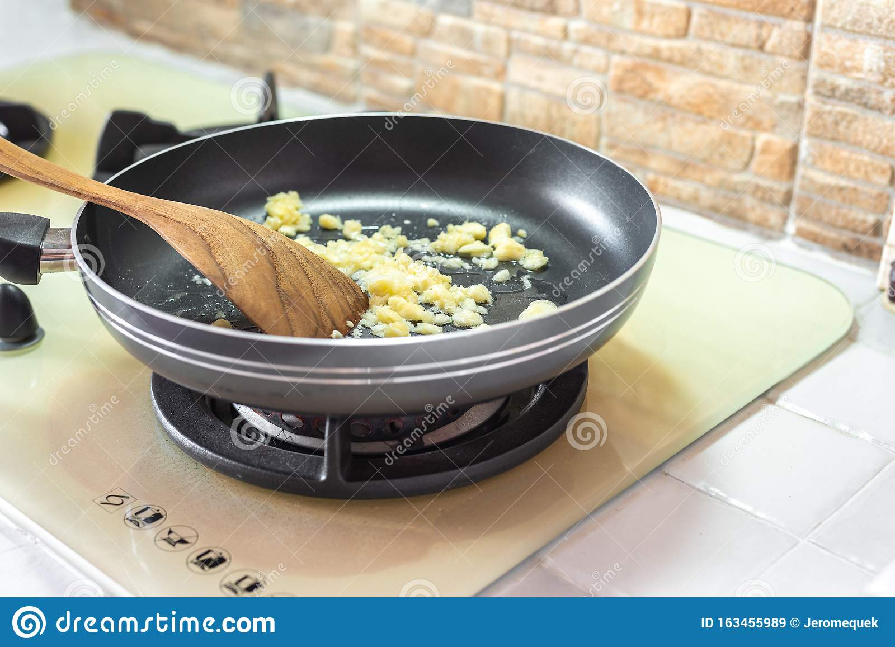
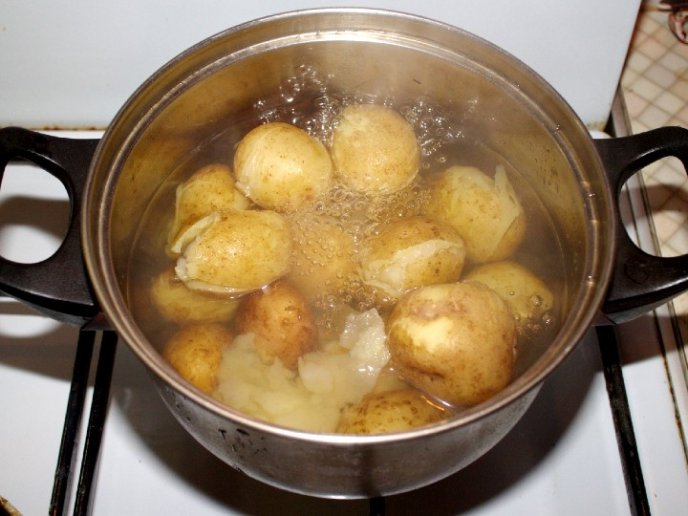
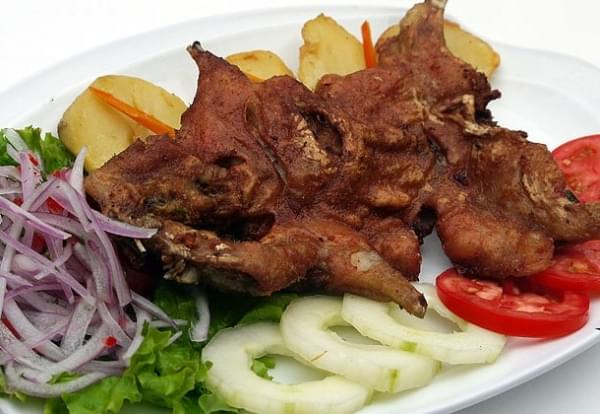

-  `#f03c15`
-  `#c5f015`
-  `#1589F0`

```diff
- text in red
+ text in green
! text in orange
# text in gray
@@ text in purple (and bold)@@
```

# ***Cuy Asado con Papas*** :+1:

<p align="center">

</p>

<div align="left">

|Cantidad|Ingredientes                  |
|---|-----------------------------------------|
| 1 |cuy pelado                               |
| 8 |dientes de ajo machacados                |
| 1 |cucharada de comino                      |
| ½ |cucharadita de achiote                   |
| 1 |kilo de papas peladas                    |
| 8 |cucharadas de aceite                     |
| 2 |ramitas de cebolletas finamente cortadas |
| 1 |cebolla colorada finamente picada        |
| 1 |pizca de orégano                         |
| 1 |pizca de pimienta molida                 |
| 1 |cucharada de cilantro                    |
| Ø |Sal a gusto                              |


</div>


# *Preparación*
```
1. Condimentar el cuy con 5 dientes de ajo, el comino y sal. Dejarlo reposar hasta el día siguiente.
```
<p align="center">

</p>

```
2. Calentar en una sartén 6 cucharadas de aceite con el achiote. Barnizar el cuy con el aceite de achiote.
```
<p align="center">

</p>

```
3. Asar el cuy en carbón, pinchándolo para que vaya cocinándose homogéneamente.
```
<p align="center">

</p>

```
4. Calentar en una sartén 2 cucharadas de aceite y añadir la cebolla, los 3 dientes de ajo restantes, las cebolletas, el cilantro, el orégano, la pimienta y sal. Cocinar durante 5 minutos.
```
<p align="center">

</p>

```
5. Agregar las papas y suficiente agua hasta cubrirlas. Esperar hasta que el agua hierva, reducir la temperatura y cocinar a fuego lento hasta que las papas estén blandas.
```
<p align="center">

</p>

```
6. Servir el cuy sobre las papas cocidas acompañado de hojas de lechuga, tomate y curtido de cebolla.
```
<p align="center">

</p>


[Para mas detalle para la preparación del Cuy Asado con Papas, por favor da clic `aquí` o mira el sig. video:](https://www.youtube.com/watch?v=1Ljelys6xWs)

[](https://www.youtube.com/watch?v=1Ljelys6xWs)

@[youtube](ZYmIUiK8ZQI|https://www.youtube.com/watch?v=ZYmIUiK8ZQI)