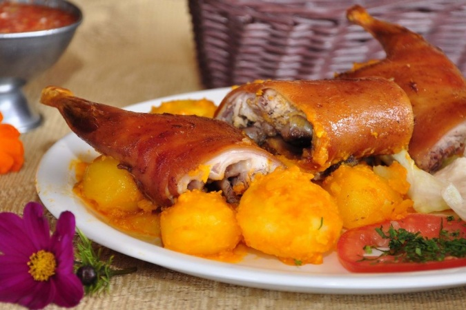

<body style="background-color:##F4D03F;">

# Cuy Asado con Papas

|              Ingredientes                  |
| -------------------------------------------|
| 1 cuy pelado                               |
| 8 dientes de ajo machacados                |
| 1 cucharada de comino                      |
| ½ cucharadita de achiote                   |
| 1 kilo de papas peladas                    |
| 8 cucharadas de aceite                     |
| 2 ramitas de cebolletas finamente cortadas |
| 1 cebolla colorada finamente picada        |
| 1 pizca de orégano                         |
| 1 pizca de pimienta molida                 |
| 1 cucharada de cilantro                    |

</body>
